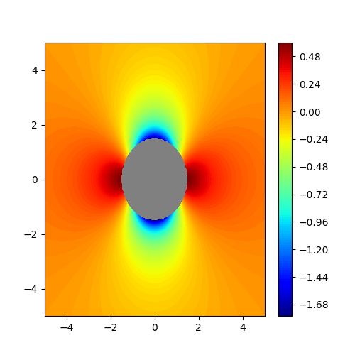

# Pressure Distribution Around a Circular Cylinder in Potential Flow

## Project Overview
This project computes and visualizes the pressure field around a circular cylinder in steady, inviscid, incompressible flow using potential flow theory. The pressure distribution is derived from the velocity field solution and visualized through high-resolution contour plots. This classical fluid mechanics problem demonstrates fundamental concepts including stagnation points, pressure minima, and the symmetric nature of ideal flow.

## Problem Statement
In fluid mechanics, understanding pressure distribution around bluff bodies is crucial for predicting forces (lift and drag) and designing aerodynamic/hydrodynamic structures. For an ideal fluid flowing past a circular cylinder, the pressure field can be derived analytically from potential flow theory. However, visualizing this pressure distribution helps engineers and researchers intuitively understand:

- Where high and low pressure regions occur
- The location of stagnation points (maximum pressure)
- The acceleration regions (minimum pressure)
- The fore-aft symmetry characteristic of inviscid flow
- How pressure varies with angular position and radial distance

This project addresses the need for a clear, computational visualization of this fundamental pressure field.

## Objectives
- Derive the pressure field from potential flow velocity solution
- Implement the analytical pressure distribution formula
- Create high-resolution contour visualization of pressure
- Demonstrate pressure symmetry in ideal flow
- Visualize stagnation and minimum pressure regions
- Provide an educational tool for fluid dynamics students and researchers

## Methodology / Approach
The solution combines potential flow theory with Bernoulli's equation:

### Theoretical Foundation
1. **Velocity Field** (from potential flow):
   - Radial velocity: Vr = U(1 - R²/r²)cos(θ)
   - Tangential velocity: Vt = -U(1 + R²/r²)sin(θ)

2. **Pressure Field** (from Bernoulli's equation):
   - P = P∞ + ½ρ(U² - V²)
   - In coefficient form: Cp = 1 - (V/U)² = 1 - 4sin²θ (on cylinder surface)
   - Full field: P = ½ρU²[2(R/r)²(cos²θ - sin²θ) - (R/r)⁴]

### Computational Implementation
1. **Domain Definition**: 
   - 2D grid from -5 to 5 in x and y directions
   - 500×500 resolution for smooth, publication-quality contours

2. **Coordinate Transformation**:
   - Convert Cartesian coordinates to polar coordinates (r, θ)
   - Handle singularities at the origin

3. **Pressure Calculation**:
   - Apply analytical formula to entire domain
   - Mask interior of cylinder (r < R) using NaN values

4. **Visualization**:
   - Filled contour plot with 150 levels for smooth gradients
   - Cylinder represented as grey circle
   - Colorbar for quantitative pressure reference

## Tools & Technologies Used
- **Programming Language**: Python 3.8+
- **Numerical Computing**: NumPy for array operations and mathematical functions
- **Data Visualization**: Matplotlib for contour plots and figure rendering
- **Mathematical Libraries**: Built-in trigonometric functions (sin, cos)
- **Development Environment**: Python script / Jupyter Notebook

## Input & Output Explanation

### Input Parameters
| Parameter | Description | Value | Units |
|-----------|-------------|-------|-------|
| x, y range | Domain size | -5 to 5 | m |
| Grid resolution | Number of points | 500×500 | - |
| U | Free stream velocity | 1.0 | m/s |
| R | Cylinder radius | 1.5 | m |
| ρ (rho) | Fluid density | 1.2 | kg/m³ |

### Output
- Filled contour plot showing pressure distribution
- Grey circle indicating cylinder location
- Colorbar showing pressure values (Pascals)
- 150 contour levels for smooth gradient visualization

## Results / Outcomes

### Key Flow Features Visualized
1. **Stagnation Points** (θ = 0°, 180°):
   - Maximum pressure (P = ½ρU² + P∞)
   - Fluid comes to rest at these points
   - Visible as red regions at front and rear

2. **Minimum Pressure Points** (θ = 90°, 270°):
   - Lowest pressure along cylinder surface
   - Corresponds to maximum velocity (V = 2U)
   - Visible as blue regions at top and bottom

3. **Pressure Recovery**:
   - Pressure increases as flow decelerates downstream
   - Complete recovery due to inviscid assumption

4. **Radial Decay**:
   - Pressure perturbations decay with distance from cylinder
   - Free stream pressure recovered far from body

### Quantitative Observations
- **Stagnation Pressure**: P_stag = ½ρU² = 0.6 Pa
- **Minimum Surface Pressure**: P_min = -1.5ρU² = -1.8 Pa (Cp = -3)
- **Pressure Coefficient Range**: -3 ≤ Cp ≤ 1

## Project Visualization

### Pressure Contour Plot Around Circular Cylinder

*Figure 1: Filled contour plot of pressure distribution around a circular cylinder (R = 1.5) in uniform flow (U = 1 m/s). Red indicates high pressure (stagnation regions), blue indicates low pressure (acceleration regions). The symmetric pattern demonstrates the inviscid nature of potential flow.*

## Author Information

**Author**: MD Naiem Gazi  
**Degree**: Mechanical Engineering Graduate  
**Email**: mdnaiemgazi@outlook.com  
**Website**: [https://mdnaiemgazi.github.io/portfolio/](https://mdnaiemgazi.github.io/portfolio/)

---

## License
This project is open-source and available for educational and research purposes. Feel free to use, modify, and distribute with appropriate attribution.
