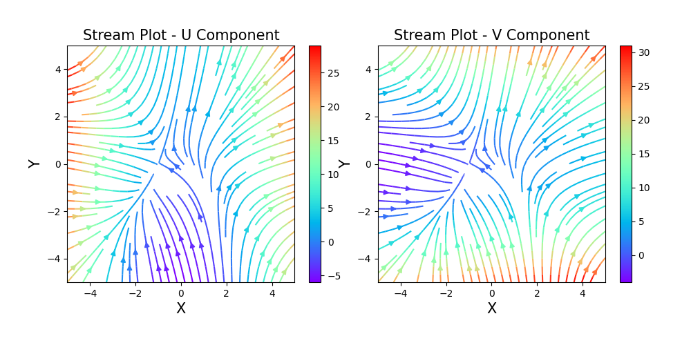

# 🌊 Thermal System Streamline Visualization


## 👨‍🔬 Author
**MD Naiem Gazi**  
*Mechanical Engineering, CUET (Chittagong University of Engineering & Technology)*

## 📋 Project Description
This project visualizes streamline patterns in thermal/fluid systems using Python. As a Mechanical Engineering graduate from CUET, I developed this tool to help visualize and analyze flow patterns that are fundamental in understanding thermal systems, fluid mechanics, and heat transfer applications.

## 🔧 Mathematical Model
The code visualizes streamlines for a 2D vector field defined by:

- **U(x,y) = x² + y - 1** (X-direction velocity component)
- **V(x,y) = x + y² + 1** (Y-direction velocity component)

These equations model simplified flow patterns that can represent:
- Natural convection currents in heated enclosures
- Fluid circulation in square cavities
- Thermal gradient-driven flows in mechanical systems
- Vortex formation in fluid dynamics

## 📊 Output Visualizations

### Basic Streamline Plot

*Figure 1: Basic streamline visualization showing U and V components with rainbow colormap. Left plot shows streamlines colored by U-component magnitude, right plot shows streamlines colored by V-component magnitude.*

### Enhanced Thermal System Analysis

*Figure 2: Comprehensive thermal system analysis showing:*
- *Top Left: U-component streamlines*
- *Top Right: V-component streamlines*  
- *Bottom Left: Velocity magnitude distribution*
- *Bottom Right: Vorticity field (indicating flow rotation)*

## 🚀 Getting Started

### Prerequisites
Ensure you have Python installed (version 3.8 or higher). Then install the required packages:

```bash
pip install numpy matplotlib
