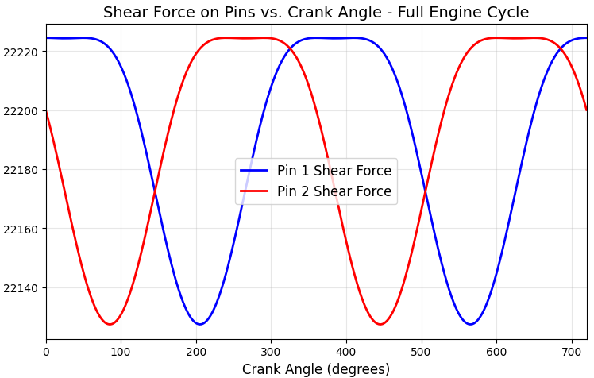

# Engine Pin Shear Force Analysis

## 📊 Visual Overview

*Figure 1: Shear force variation on Pin 1 and Pin 2 over a complete 720-degree engine cycle*

---

## 📋 Project Overview

This project analyzes the shear forces acting on engine pins throughout a complete four-stroke engine cycle (0 to 720 degrees crank angle). Using experimental data from an internal combustion engine, the script processes and visualizes the mechanical loading conditions on two critical pins, providing insights essential for durability analysis and design validation.

## 🎯 Problem Statement

Engine pins are subjected to complex, cyclic shear forces during operation. Understanding the magnitude, timing, and distribution of these forces is crucial for:
- Preventing premature mechanical failure
- Optimizing material selection and pin design
- Validating computational models against experimental data
- Identifying critical operating points for structural analysis

Raw sensor data in tabular format is difficult to interpret; therefore, a clear visual representation is essential for meaningful engineering analysis.

## ✅ Objectives

- Load and process experimental shear force data from CSV files
- Isolate data corresponding to a complete 720-degree engine cycle
- Generate comparative visualizations for two engine pins
- Identify peak force locations and cyclic patterns
- Provide reproducible analysis for engineering documentation

## 🔬 Methodology / Approach

### Data Processing Pipeline
1. **Data Acquisition**: Read CSV file containing engine test data using pandas
2. **Data Filtering**: Select first 722 rows representing one full cycle (0-720°)
3. **Feature Extraction**: Extract crank angle and shear force columns for Pin 1 and Pin 2
4. **Visualization**: Generate line plot with matplotlib showing force variations
5. **Analysis**: Compare force patterns and identify critical points

### Technical Implementation
- **Data handling**: Pandas DataFrame for efficient data manipulation
- **Visualization**: Matplotlib for publication-quality plots
- **File handling**: Robust path handling for cross-platform compatibility

## 🛠️ Tools & Technologies

| Category | Technology | Purpose |
|----------|------------|---------|
| **Language** | Python 3.x | Core programming |
| **Data Processing** | Pandas | CSV reading and data manipulation |
| **Visualization** | Matplotlib | Plot generation and customization |
| **Numerical Computing** | NumPy | Mathematical operations (backend) |

## 📂 Input & Output

### Input File: `engine_file.csv`
The CSV file contains engine test data with columns:
- `Crank Angle (deg)`: Crank position from 0° to 720°
- `Shear Force Pin_1`: Force measurements for Pin 1 (Newtons)
- `Shear Force Pin_2`: Force measurements for Pin 2 (Newtons)
- Additional columns for piston effort, connecting rod forces, etc.

### Output
- **Visualization Plot**: Line plot showing shear force vs. crank angle for both pins
- **Console Output**: Data verification messages and DataFrame shape

## 📈 Results & Outcomes

### Key Findings
- **Cyclic Pattern**: Both pins exhibit periodic force variations synchronized with the engine cycle
- **Peak Forces**: Maximum shear forces occur at specific crank angles, identifiable from the plot
- **Pin Comparison**: Pin 1 and Pin 2 show similar force patterns but with magnitude differences
- **Zero Crossings**: Forces cross zero at multiple points, indicating direction changes

### Engineering Significance
- Critical loading angles identified for structural analysis
- Baseline data for FEA model validation
- Input for fatigue life prediction studies
- Documentation for design review and optimization

---

## 👨‍🔬 Author Information

**MD Naiem Gazi**  
*Mechanical Engineering Graduate*  

📧 **Email**: [mdnaiemgazi@outlook.com](mailto:mdnaiemgazi@outlook.com)  
🌐 **Portfolio**: [https://mdnaiemgazi.github.io/portfolio/](https://mdnaiemgazi.github.io/portfolio/)  

**Research Interests**: Engine Dynamics, Mechanical Systems Analysis, Data-Driven Engineering

---

## 📁 Repository Structure
