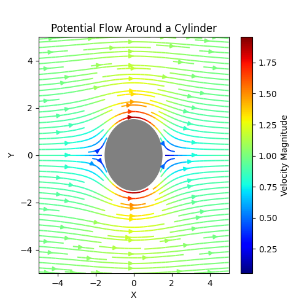

# Potential Flow Analysis: Streamline Visualization Around a Cylinder

This project provides a computational simulation and visualization of potential flow around a circular cylinder. It demonstrates the application of fundamental fluid dynamics principles using numerical methods and graphical plotting in Python.

## Project Overview
This Python script models the irrotational flow of an inviscid fluid around a stationary circular cylinder. By solving the analytical velocity field for potential flow, the program generates a detailed streamline plot colored by velocity magnitude. The cylinder itself is masked to represent a solid body, offering a clear visualization of flow patterns, stagnation points, and areas of high velocity.

## Problem Statement
Understanding flow behavior around bluff bodies is fundamental in mechanical and aerospace engineering. While analytical solutions exist for ideal potential flow, visualizing these complex velocity fields can be challenging. This project aims to bridge the gap between theoretical fluid mechanics and practical computational visualization by accurately rendering the streamline patterns of flow past a cylinder.

## Objective
- To compute the theoretical velocity field for potential flow around a cylinder using polar coordinate transformations.
- To visualize the flow patterns through high-quality, color-mapped streamlines.
- To clearly distinguish the solid body of the cylinder from the fluid flow in the final plot.

## Methodology / Approach
1.  **Grid Generation**: A 2D Cartesian grid is created using `numpy.linspace` and `meshgrid` to define the spatial domain.
2.  **Coordinate Transformation**: The grid points are converted from Cartesian (x, y) to polar coordinates (r, θ) to simplify the application of the analytical flow equations.
3.  **Velocity Field Calculation**: The radial (Vr) and tangential (Vt) velocity components are calculated using the standard potential flow solution for a cylinder.
4.  **Masking**: Velocity values inside the cylinder radius (r < R) are set to `NaN` (Not a Number) to exclude them from the plot, effectively masking the solid body.
5.  **Visualization**: `matplotlib` is used to plot the cylinder and generate streamlines. The streamlines are colored by the local velocity magnitude using a 'jet' colormap to highlight flow acceleration around the cylinder's sides.

## Tools & Technologies Used
- **Python**: Core programming language.
- **NumPy**: For efficient numerical array operations and mathematical functions (sin, cos, sqrt).
- **Matplotlib**: For creating the visualization, including the circle patch and streamlines.

## Input & Output Explanation
- **Input Parameters**:
    - `U`: Free stream velocity (set to 1 m/s).
    - `R`: Radius of the cylinder (set to 1.5 units).
    - `x`, `y`: Grid limits and resolution.
- **Output**:
    - A 5x5 figure displaying the flow field. The plot shows streamlines originating from the left, flowing around a solid grey circle. The color of the streamlines corresponds to the velocity magnitude, with a colorbar provided for reference.

## Results / Outcomes
The generated plot successfully illustrates the key characteristics of potential flow around a cylinder:
- **Stagnation Points**: Flow slows to zero at the front and rear of the cylinder.
- **Flow Acceleration**: The fluid accelerates as it moves over the top and bottom of the cylinder, indicated by the color shift to higher magnitudes (yellows/reds in the jet colormap).
- **Symmetry**: The flow pattern shows perfect symmetry, both upstream/downstream and top/bottom, which is a defining feature of ideal, inviscid potential flow.

**Sample Visualization:**

---

### Author Information
**Name:** MD Naiem Gazi  
**Degree:** Mechanical Engineering Graduate  
**Email:** mdnaiemgazi@outlook.com  
**Website:** [https://mdnaiemgazi.github.io/portfolio/](https://mdnaiemgazi.github.io/portfolio/)
